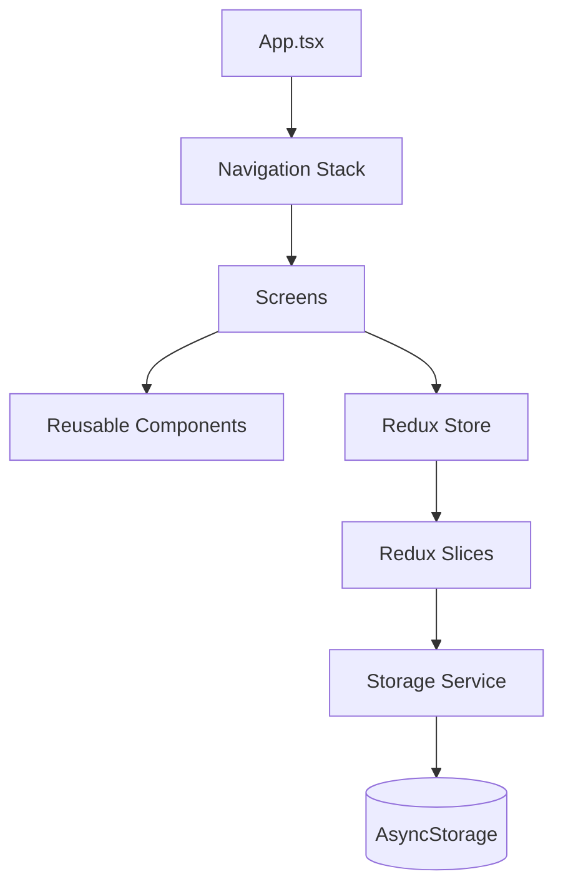

# Architecture Documentation

This document describes the high-level architecture, project structure, and key design patterns used in the NerdBug-mobile application.

## High-Level Overview

NerdBug-mobile is built on a modular architecture inspired by the Qashr project. It follows a clean separation of concerns between UI, state, and data persistence.

### Component Diagram

## Directory Structure

- screens/: Contains the top-level page components. Each screen is responsible for its own layout and connecting to the Redux store.
- components/: Reusable UI elements like buttons, inputs, and list items. Components should be stateless where possible.
- navigation/: Configuration for the React Navigation stack and navigation types.
- redux/: Centralized state management using Redux Toolkit.
  - slices/: Individual state slices (e.g., notesSlice).
  - store.ts: Root store configuration.
- services/: Business logic and external integrations.
  - storage.ts: Handles local persistence using AsyncStorage.
- theme/: Global style constants including colors, typography, and spacing.
- utils/: Helper functions and utility constants.
- data/: Static strings, configuration, and constant data.

## Data Flow

1. User Action: A user interacts with a screen (e.g., clicks "Add Note").
2. Dispatch: The screen dispatches an action to the Redux store.
3. Reducer: Redux Toolkit updates the state in the corresponding slice.
4. Persistence: Middleware or manual triggers in the screen/service layer ensure the new state is saved to AsyncStorage via StorageService.
5. UI Update: The screen re-renders based on the updated Redux state.

## State Management

We use Redux Toolkit for its simplicity and built-in best practices.
- Single Source of Truth: All application state resides in the Redux store.
- Predictable Transitions: State can only be modified through defined actions and reducers.

## Responsive Design

The application uses react-native-responsive-screen to achieve a consistent look across different screen sizes and orientations.
- wp(percentage): Returns the width of the screen relative to the percentage provided.
- hp(percentage): Returns the height of the screen relative to the percentage provided.

## Next Steps

For information on how to contribute to this project, please see CONTRIBUTING.md.
